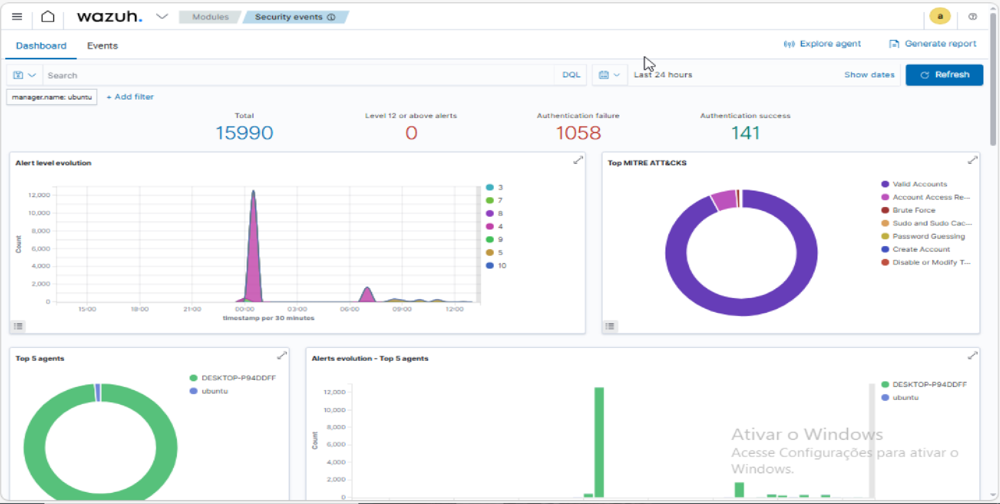
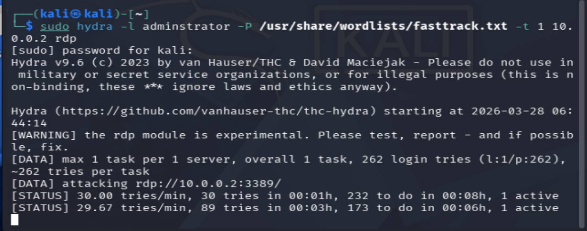

# 🛡️ SIEM Lab: Detecção de Ataques de Força Bruta com Wazuh

Este projeto demonstra a implementação de um ambiente de monitoramento de segurança (SIEM) para detectar, analisar e elevar a criticidade de tentativas de invasão via **Brute Force (T1110)** em endpoints Windows 10.

---

## 🏗️ Topologia do Laboratório

* **SIEM:** Wazuh Manager (Ubuntu Server 22.04)
* **Endpoint:** Windows 10 Pro (Wazuh Agent)
* **Atacante:** Kali Linux (Hydra)

---

## ⚔️ Simulação do Incidente (Ataque)

Utilizei o **Hydra** no Kali Linux para simular um ataque de força bruta contra o serviço SMB do Windows. O objetivo foi validar se o Wazuh capturaria a telemetria necessária para identificar o comportamento anômalo em tempo real.



### 🕵️ Detecção e Mapeamento MITRE ATT&CK

O ataque gerou múltiplos eventos de falha de login (**Event ID 4625**). O Wazuh correlacionou esses logs automaticamente com as técnicas:
* **T1110 (Brute Force)**
* **T1078 (Valid Accounts)**



---

## 💎 Evidência Técnica: Estrutura do Alerta (JSON Payload)

Para um Analista de SOC, a análise do JSON é fundamental para entender os campos extraídos e criar automações. Abaixo, o log bruto onde identificamos o IP do atacante (`10.0.0.3`) e a workstation de origem (`kali`).

<details>
  <summary>📂 Clique para expandir o JSON completo</summary>

```json
{
  "agent": {
    "ip": "10.0.0.2",
    "name": "DESKTOP-P94DDFF",
    "id": "001"
  },
  "data": {
    "win": {
      "eventdata": {
        "ipAddress": "10.0.0.3",
        "targetUserName": "adminstrator",
        "workstationName": "kali",
        "status": "0xc000006d"
      },
      "system": {
        "eventID": "4625",
        "severityValue": "AUDIT_FAILURE",
        "computer": "DESKTOP-P94DDFF"
      }
    }
  },
  "rule": {
    "level": 10,
    "description": "Multiple Windows logon failures.",
    "id": "60204",
    "mitre": {
      "technique": ["Brute Force"],
      "id": ["T1110"],
      "tactic": ["Credential Access"]
    }
  },
  "@timestamp": "2026-03-28T14:21:37.733Z"
}

## 🛠️ Engenharia de Detecção (Customização de Rules)
Um dos grandes desafios deste projeto foi a criação de uma regra personalizada no local_rules.xml para elevar a criticidade do evento de Nível 10 para o Nível 12 (Crítico).

## 🔧 Desafios de Troubleshooting
Durante a implementação, enfrentei erros de sintaxe XML que impediram o reinício do serviço do Wazuh. A resolução envolveu o uso de ferramentas de diagnóstico do sistema (wazuh-analysisd -t) e correção de tags de fechamento.

## ✅ Validação Final (Wazuh-Logtest)
Utilizando a ferramenta wazuh-logtest, confirmei que o motor de análise agora identifica o ataque sob a nova regra ID 100001 com Level 12, garantindo prioridade máxima no monitoramento e alertas vermelhos no Dashboard.

##📈 Próximos Passos
[ ] Active Response: Configurar o bloqueio automático (ban) do IP do atacante no Firewall do Windows.

[ ] Sysmon Integration: Refinar a visibilidade de processos e eventos de rede no Windows.

[ ] Continuous Learning: Continuar o aprofundamento em plataformas como TryHackMe e LetsDefend para novos cenários de ameaças.
